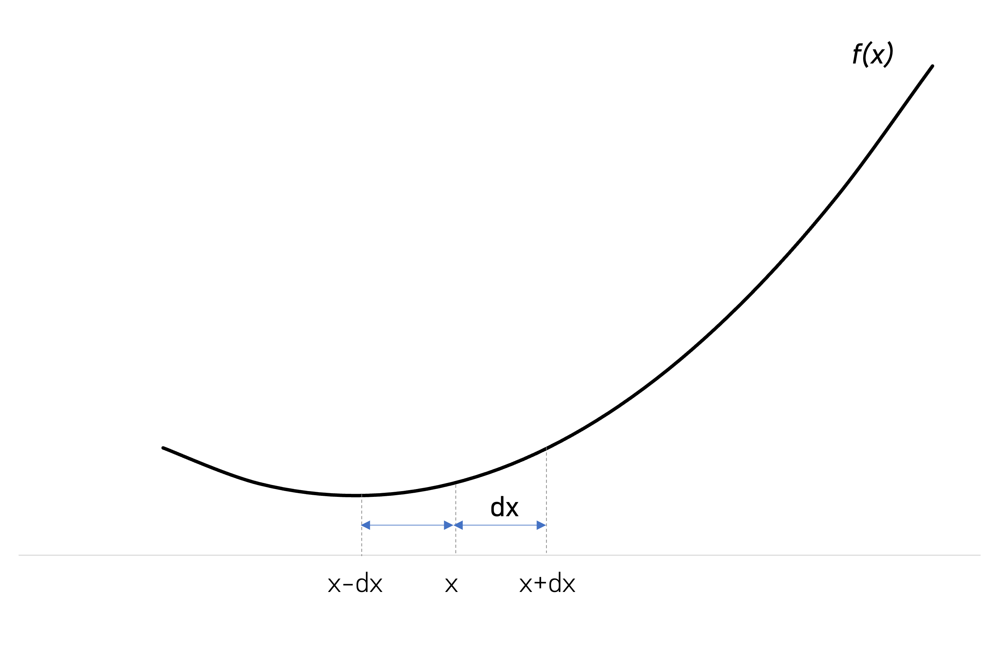
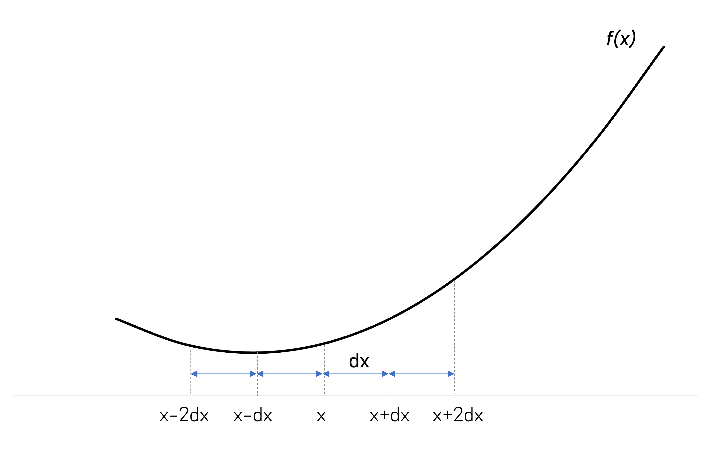

In [Numerical method 1: Finite difference](https://zul.rocks/finite-difference), I show that derivatives can be solved numerically using the following formula:

$$\begin{equation}
f^{\prime}(x) = \dfrac{f(x+dx) - f(x-dx)}{2dx} \\
f^{\prime\prime}(x)= \dfrac{f(x-1) - 2f(x) + f(x+1)}{(dx)^{2}}
\end{equation}$$

How are these formulas derived, and how to generalize to third, fourth or higher-order derivatives?


We only need to know two things: Taylor's rule

$$\begin{align*}
f(x+a) &= f(x) + af^{\prime}(x) + \frac{a^{2}}{2!}f^{\prime\prime}(x) + \frac{a^{3}}{3!}f^{\prime\prime\prime}(x) \cdots \\ 
\end{align*}$$

and matrix inversion. All of these can be scripted in python from scratch.


### Deriving for first derivatives

Suppose we are looking for first derivatives at point $$x$$. There are three points of interest; $$x$$, and the points surrounding it, $$x-dx, x+dx$$:



The corresponding values are: 
$$\begin{align}
f(x-dx) &= f(x) - dxf^{\prime}(x) + \frac{dx^{2}}{2!}f^{\prime\prime}(x) - \frac{dx^{3}}{3!}f^{\prime\prime\prime}(x) \cdots \\
f(x)&= f(x) \\
f(x+dx) &= f(x) + dxf^{\prime}(x) + \frac{dx^{2}}{2!}f^{\prime\prime}(x) + \frac{dx^{3}}{3!}f^{\prime\prime\prime}(x) \cdots 
\end{align}$$

What we are seeking for is a set of coefficients which  combine these equations into the form:

$$\begin{equation}
f^{\prime}(x) = \text{ something } f(x-dx) + \text{ something } f(x) + \text{ something }f(x+dx)
\end{equation}$$ 

Multiply the three equations above with arbitrary scalars $$a,b$$ and $$c$$ respectively:

$$\begin{align*}
af(x-dx) &= af(x) - adxf^{\prime}(x)+ a\frac{dx^{2}}{2!}f^{\prime\prime}(x) - a\frac{dx^{3}}{3!}f^{\prime\prime\prime}(x) \cdots \\
bf(x)&= bf(x) \\
cf(x+dx) &= cf(x) + cdxf^{\prime}(x) + c\frac{dx^{2}}{2!}f^{\prime\prime}(x) + c\frac{dx^{3}}{3!}f^{\prime\prime\prime}(x) \cdots 
\end{align*}$$

Adding them leads to **Equation 1**:

$$\begin{align}
af(x-dx) + bf(x)+cf(x+dx) &= (a+b+c)f(x) \\
&+(-a+c)dxf^{\prime}(x) \\
&+ (a+c)\frac{dx^{2}}{2!}f^{\prime\prime}(x) \\
&+ \text{residuals (error terms)}
\end{align}$$

From the right hand side, as we are only interested in $$f^{\prime} (x)$$, set the scalars as follow:

>$$a+b+c=0$$
>
>$$-a+c = \frac{1}{dx}$$
>
>$$a+c  = 0$$

This relationship can be converted into a matrix form $$\mathbf{A}\mathbf{w}= \mathbf{s}$$. 

$$
\begin{pmatrix}
  1 & 1 & 1 \\
  -1 & 0 & 1 \\
  1 & 0 & 1
 \end{pmatrix}
\begin{pmatrix}
  a\\
 b \\
 c
 \end{pmatrix}
 =
 \begin{pmatrix}
  0\\
  \frac{1}{dx}\\
 0
 \end{pmatrix}
$$


with $$\mathbf{w}=\mathbf{A}^{-1} \mathbf{s}$$. All of these can be done in python:

```python
# Import libaries
import math
import numpy as np
import matplotlib.pyplot as plt

#Size of matrix mxm. Needs to be odd and larger than derivatives order n
nop=3
# Set order of derivative (1 - first derivative, 2 - second derivative and so on)
n = 1
# Produce matrix A
A = np.zeros((nop, nop))
    for i in range(nop):
        for j in range(nop):
            dx = j - nop // 2
            A[i, j] = dx ** i
#Produce vector s = s'(1/dx), i,e we take out 1/dx for ease of calculation
s = np.zeros(nop)
s[n] = math.factorial(n)
    
 #Return w= inv(m) s
w = np.linalg.solve(m, s)
```
> print(w)

> [-0.5  0.   0.5]


Hence, $$a= \frac{-1}{2dx}, b=0, c=\frac{1}{2dx}$$. Substitute these into **Equation 1** and we are done:

$$\begin{align*}
f^{\prime}(x) = \dfrac{- f(x-dx)+f(x+dx) }{2dx}
\end{align*}$$

### Deriving for second or higher-order derivatives

The procedures can be replicated for derivatives of higher order. For second derivatives, we are only interested in $$f^{\prime\prime} (x)$$ from the right hand side of **Equation 1**. As such, set the scalars as follow:

>$$a+b+c=0$$
>
>$$-a+c = 0$$
>
>$$a+c  = \frac{2!}{dx^2}$$

Convert this into a matrix form $$\mathbf{A}\mathbf{w}= \mathbf{s}$$. 

$$
\begin{pmatrix}
  1 & 1 & 1 \\
  -1 & 0 & 1 \\
  1 & 0 & 1
 \end{pmatrix}
\begin{pmatrix}
  a\\
 b \\
 c
 \end{pmatrix}
 =
 \begin{pmatrix}
  0\\
  0\\
 \frac{2!}{dx^2}
 \end{pmatrix}
$$

and solve $$\mathbf{w}$$ in python:

```python
# Import libaries
import math
import numpy as np
import matplotlib.pyplot as plt

#Size of matrix mxm. Needs to be odd and larger than derivatives order n
nop=3
# Set order of derivative (1 - first derivative, 2 - second derivative and so on)
n = 2
# Produce matrix A
A = np.zeros((nop, nop))
    for i in range(nop):
        for j in range(nop):
            dx = j - nop // 2
            A[i, j] = dx ** i
#Produce vector s = s'(1/dx^2), i,e we take 1/dx^2 for ease of calculation
s = np.zeros(nop)
s[n] = math.factorial(n)
    
 #Return w= inv(m) s
w = np.linalg.solve(m, s)
```
> print(w)

> [ 1. -2.  1.]

Hence, $$a= \frac{1}{dx^{2}}, b=\frac{-2}{dx^{2}}, c=\frac{1}{dx^{2}}$$. Substitute these into **Equation 1** and we are done:

$$\begin{align*}
f^{\prime\prime}(x)= \dfrac{f(x-1) - 2f(x) + f(x+1)}{(dx)^{2}}
\end{align*}$$

Similar steps can be taken for third derivatives, except that now we need to expand our grid points to include grid points $$x-2dx$$ and $$x+2dx$$:



Therefore our system of equations is also larger by additional 2 rows and 2 columns:

$$\begin{align*}
af(x-2dx) &= af(x) - a2dxf^{\prime}(x)+ a\frac{4dx^{2}}{2!}f^{\prime\prime}(x) - a\frac{8dx^{3}}{3!}f^{\prime\prime\prime}(x) +a\frac{16dx^{4}}{4!}f^{\prime\prime\prime\prime}(x)\cdots \\
bf(x-dx) &= bf(x) - bdxf^{\prime}(x)+ b\frac{dx^{2}}{2!}f^{\prime\prime}(x) - b\frac{dx^{3}}{3!}f^{\prime\prime\prime}(x) +b\frac{dx^{4}}{4!}f^{\prime\prime\prime\prime}(x)\cdots \\
cf(x)&= cf(x) \\
df(x+dx) &= df(x) + ddxf^{\prime}(x) + d\frac{dx^{2}}{2!}f^{\prime\prime}(x) + d\frac{dx^{3}}{3!}f^{\prime\prime\prime}(x) + d\frac{dx^{4}}{4!}f^{\prime\prime\prime\prime}(x)\cdots  \\
ef(x+2dx) &= ef(x) + e2dxf^{\prime}(x) + e\frac{4dx^{2}}{2!}f^{\prime\prime}(x) + e\frac{8dx^{3}}{3!}f^{\prime\prime\prime}(x) + e\frac{16dx^{4}}{4!}f^{\prime\prime\prime\prime}(x)\cdots 
\end{align*}$$

The sum of which yields:

$$\begin{align*}
af(x-2dx) &+ bf(x-dx)+cf(x) + df(x_dx) + ef(x+2dx) \\
&= (a+b+c+d+e)f(x) \\
&+(-2a-b+d+2e)dxf^{\prime}(x) \\
&+ (4a+b+d+4e)\frac{dx^{2}}{2!}f^{\prime\prime}(x) \\
&+ (-8a-b+d+8e)\frac{dx^{3}}{3!}f^{\prime\prime\prime}(x)\\
&+ (16a+b+d+16e)\frac{dx^{4}}{4!}f^{\prime\prime\prime\prime}(x)\\
&+ \text{residuals (error terms)}
\end{align*}$$


As we are interested only in $$f^{\prime\prime\prime}(x)$$, set the scalars on the right hand side as follows:

>$$a+b+c+d+e =0$$
>
>$$-2a-b+d+2e=0$$
>
>$$4a+b+d+4e =0$$
>
>$$-8a-b+d+8e= \frac{3!}{dx^{3}}$$
>
>$$16a+b+d+16e =0$$


This can be written in matrix form $$\mathbf{A}\mathbf{w}= \mathbf{s}$$:

$$
\begin{pmatrix}
  1 & 1 & 1 &1&1\\
  -2 & 1 &0& 1&2 \\
  -4&1&0 & 1 & 4\\
  -8&-1&0&1&8\\
  -16&1&0&1&16
 \end{pmatrix}
\begin{pmatrix}
  a\\
 b \\
 c \\
 d\\
 e
 \end{pmatrix}
 =
 \begin{pmatrix}
  0\\
  0\\
 0\\
 \frac{3!}{dx^3}\\
 0
 \end{pmatrix}
$$

and solve $$\mathbf{w}$$ in python:

```python
# Import libaries
import math
import numpy as np
import matplotlib.pyplot as plt

#Size of matrix mxm. Needs to be odd and larger than derivatives order n
nop=5
# Set order of derivative (1 - first derivative, 2 - second derivative and so on)
n = 3
# Produce matrix A
A = np.zeros((nop, nop))
    for i in range(nop):
        for j in range(nop):
            dx = j - nop // 2
            A[i, j] = dx ** i
#Produce vector s = s'(1/dx^2), i,e we take 1/dx^2 for ease of calculation
s = np.zeros(nop)
s[n] = math.factorial(n)
    
 #Return w= inv(m) s
w = np.linalg.solve(m, s)
```
> print(w)

> [-0.5  1.   0.  -1.   0.5]

Hence $$a = \frac{-1}{2dx^{3}}, b = \frac{1}{dx^{3}}, c= 0 , d=\frac{-1}{dx^{3}}, e =\frac{1}{2dx^{3}}$$,

leading to

$$\begin{align*}
f^{\prime\prime\prime}(x)= \dfrac{-f(x-2) +2f(x-1)-2f(x+1) + f(x+2)}{2dx^{3}}
\end{align*}$$ 

### Epilogue

The key to these derivation is ultimately in constructing the matrix form $$\mathbf{A}\mathbf{w} = \mathbf{s}$$. Although the steps appear slightly complicated as we go to larger derivatives, they follow the same algorithm namely these lines in the python code:

```python
#Size of matrix mxm. Needs to be odd and larger than derivatives order n
nop= xx
# Set order of derivative (1 - first derivative, 2 - second derivative and so on)
n = xx
# Produce matrix A
A = np.zeros((nop, nop))
    for i in range(nop):
        for j in range(nop):
            dx = j - nop // 2
            A[i, j] = dx ** i
#Produce vector s 
s = np.zeros(nop)
s[n] = math.factorial(n)
```


Reference:

1. [Computational Seismology: A Practical Introduction](https://www.amazon.com/Computational-Seismology-Introduction-Heiner-Igel/dp/0198717415)
2. [Berkeley Python Numerical Methods](https://pythonnumericalmethods.berkeley.edu/notebooks/Index.html)
3. [Heiner Igel's course](https://www.coursera.org/learn/computers-waves-simulations)